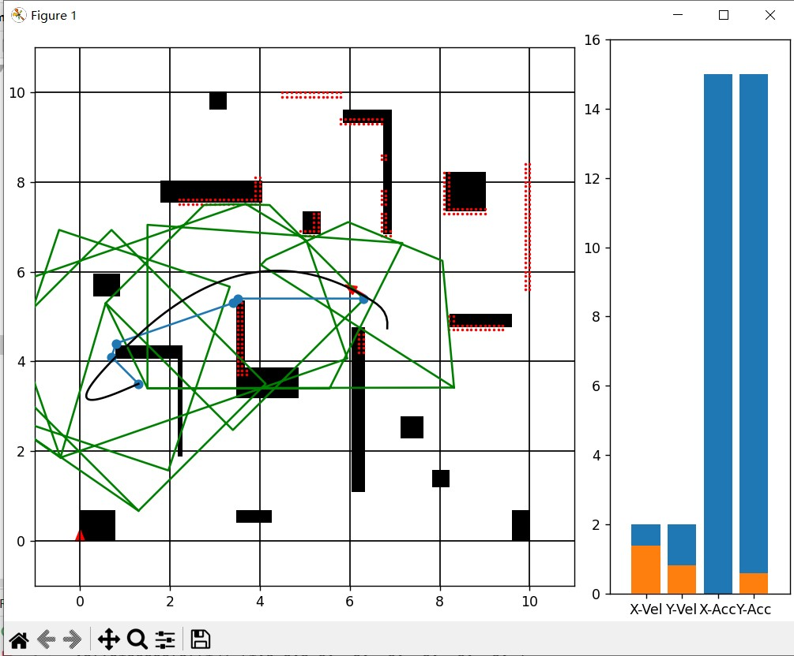

# Planner2D
基于开源项目实现了一个根据安全飞行走廊的轨迹规划器。
使用分段多项式生成平滑且动态可行的轨迹，优化目标包括最小化轨迹的高阶导数。
修改了原项目的错误，优化了代码逻辑，实现了位置环境生成，传感器模拟与重规划逻辑。
最后利用`matplotlib`实现了仿真动画。

## Run
执行`main.py`

|  Example1   | Example2  |
|  ----  | ----  |
|   |  |

## TODO
- [ ] 基于运动学的前端轨迹生成器，由于初始状态不为零，纯粹的A*等算法生成的轨迹未考虑当前速度等条件，不能成功优化
- [ ] 全局规划期剪枝。
- [ ] MPC跟踪器
- [ ] 增加传感器范围显示，增加重规划
- [X] 增加航向的规划

**以下为原始项目**
---
# SimplePlanner

Simple 2D implement of the paper "Planning Dynamically Feasible Trajectories for Quadrotors Using Safe Flight Corridors in 3-D Complex Environments".

## Info

This repo only aims to help to better understand the paper "Planning Dynamically Feasible Trajectories for Quadrotors Using Safe Flight Corridors in 3-D Complex Environments".

## Modules

This repo include three modules:

jps.py is the implement of the Jump Point Search (JPS) algorithm.

convex_decomp.py is the implement of the convex decompose according to a given path.

trajectory_optmization.py is the implement of the trajectory optimization. The trajectory is a piece-wise bezier curve and the optimization solver is osqp.
